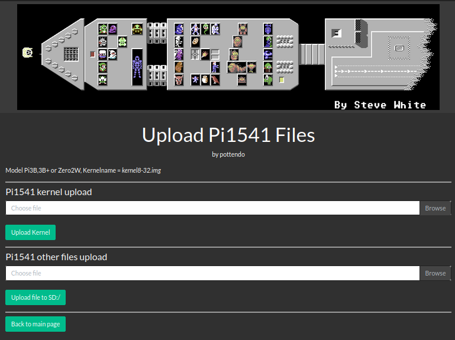
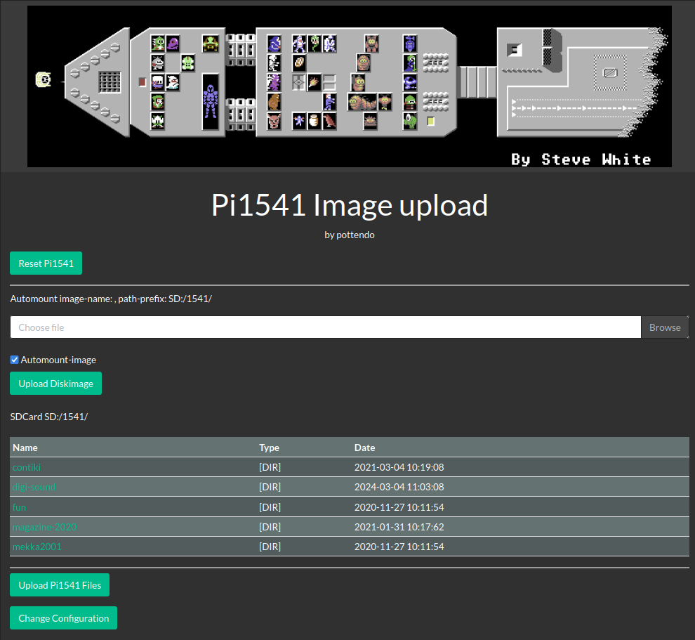

# Pi1541 - Circle ported, ready for new features

This is an optional port of Pi1541 (V1.24) to the current Circle bare metal library (as of March 2025, Version 49.0).

As almost all Pi model specific bindings which have a counterparts in Circle have been removed. This allows to use the potential of Circle to extend Pi1541 with new functionalities. 
A simple web-server features
- upload of images to the SDCard
- upload of a Pi1541 kernel image
- upload of Pi1541 _options.txt_ file

Some further ideas:
- Enhance webserver to support image administration (copy, move, delete, rename, etc.)
- Make options changeable via a WebGUI
- ...

Credits to Stephen (@pi1541) [Pi1541](https://cbm-pi1541.firebaseapp.com/) and [Pi1541-github](https://github.com/pi1541/Pi1541), Rene (@rsta2) [circle](https://github.com/rsta2/circle), Stephan (@smuehlst) [circle-stdlib](https://github.com/smuehlst/circle-stdlib) for the brilliant base packages!

Status
------
The following is supposed to work on the circle based _V1.24c_, as I've tested those functions a bit:
- Pi1541 on Raspberry models 3B+, PiZero 2W, 4: successful load (JiffyDOS) of some games with fastloaders and GEOS
- LCD Display SSD1306
- Rotary Input
- Option A HW Support 
- Option B HW Support 
- Buzzer sound output
- PWM/DMA Soundoutput (sounds nicer than in legacy codebase, IMHO)
- USB Keyboard and USB Massstorage (improved over original, see also Bugs below)
- Ethernet or WiFi network (if configured) starts and seeks for a DHCP server, a webserver runs

Credits to @znarf in F64, who kindly tested Option B HW.
<p>

If enabled (see below), network is activated in the background. For Wifi it may take a few seconds to connect and retreive the IP Address via DHCP.
The IP address is briefly shown on the LCD, once received. One can check the IP address on the screen (HDMI).
<p>

The webserver controls the main emulation loop (e.g. uploads finished) by global variables. Access to the SDCard Filesystem is not synchronized or otherwise protected. If an (C64-) application writes to its disk, respectivley to the disk-image on Pi1541 and in parallel the webserver is used to upload the very same image, file-corruption or even file-system corruption may occur. The server and parallel emulation seems quite independent. I've tested a critical fastloader(Ghost'n'Goblins Arcade) and uploading in parallel successfully.
<p>
Note: checking the <i>Automount-image</i> checkbox, uploads and overrides the default automount image automatically inserts it in the caddy. This allows an efficient development workflow, IMHO.


<p>
Updates of Pi1541 kernel images or _options.txt_ require the correct filenames and enforce those. Once the filename is correct the those are overridden on the SDCard, no backup is made!



<p>

The codebase is the publically available Pi1541 code, V1.24 (as of Jan. 2024) with some improvements:
- LED/Buzzer work again as in 1.23
- some bugfixes to avoid crash (missing initializer)
- build support for moden GCCs (-mno-unaligend-access)
- new option `headLess`, see below
- as a reset button is missing on most PIs, this is mapped to the button combo which selects DriveID 11 (a rare use-case for me)

Still the legacy code can be built with support for all supported hardware variants, include PiZero, Pi1 and Pi2 variants - see build chapter _Build_.
The floppy emulation is entirely untouched, so it's as good as it was/is in V1.24 - which is pretty good, IMHO! **Credits to Stephen!**
<p>

Other uController support has been added:
- Raspberry Pico 2 W (see directory _pico1541_)
- ESP32 (PSRAM) (see directory _esp1541_)

However, the code compiles and runs in principle on those platforms; due to the limits of those uControllers Pi1541 won't run. The code can be used as base for further more powerful uControllers providing sufficient memory and performance to handel Pi1541 hard realtime requirements.

**Attention**: the operating temperature is substantially higher than with the original kernel (legacy build). It is recommended to use _active_ cooling as of now. Raspeberry PIs normally protect themselves through throtteling. This should work lates at 85C - you may lower this threshold via `cmdline.txt` using e.g. `socmaxtemp=78`.

TODOs
-----
- Allow static IP Adresses for faster startup, to be configured in `options.txt`
- Make execution more efficient wrt. CPU usage to keep temperature lower, use throtteling to protect the Pi.
- Provide a helper script to collect all files to make Pi1541 sdcard build easy
- Test more sophisticated loaders (RT behavior)

What will not come
------------------
- PiZero support for circle, as it doesn't make sense due to lack of network support
- Circle Support for all variants of Pi1 and Pi2, as I don't have those to test
- Pi5 support - with support from @rsta, I found that the GPIO performance of the Pi5 is significantly slower than on earlier models due to its changed hardware architecture. Even with some tweaking, Pi1541 misses cycles and emulation breaks. The code is prepared for Pi5, but as of now not working. It requires the circle-development branch as some optimized GPIO functions aren't released yet.
- Pico2/ESP32 support
  
Additional Options in `options.txt`
-----------------------------------
The following options control new functions available:
| Option      | Value  | Purpose                                  |
| ----------- | ------ | ---------------------------------------- |
| netEthernet | 0 or 1 | disable/enable Ethernet network          |
| netWifi     | 0 or 1 | disable/enable Wifi network              |
| headLess    | 0 or 1 | disable/enable headless (no HDMI output) |

Know Bugs
---------

- Pluging in a USB stick _after_ booting, won't show files on the USB mounted drive and display remains dark. Unplugging/re-plugging works as expected if USB is plugged in at startup
- Pi5 not yet working

Checkout & Build
----------------
One can build the Version 1.24 (+some minor fixes: LED & Buzzer work, build/works with gcc > 10.x).
The following compiler suites were used for development:

| Compiler | Package name                                     | Link                                                                                                                                          | Arch               |
| -------- | ------------------------------------------------ | --------------------------------------------------------------------------------------------------------------------------------------------- | ------------------ |
| GCC      | AArch32 bare-metal target (arm-none-eabi)        | [download](https://developer.arm.com/-/media/Files/downloads/gnu/13.2.rel1/binrel/arm-gnu-toolchain-13.2.rel1-x86_64-arm-none-eabi.tar.xz)    | 32 bit             |
| GCC      | AArch64 ELF bare-metal target (aarch64-none-elf) | [download](https://developer.arm.com/-/media/Files/downloads/gnu/13.2.rel1/binrel/arm-gnu-toolchain-13.2.rel1-x86_64-aarch64-none-elf.tar.xz) | 64 bit (RPi4 only) |

Make sure your `PATH` variable is set appropriately to find the installed compiler suite.

The project is built by:

```
BUILDDIR=build-pottendo-Pi1541
mkdir $BUILDDIR
cd ${BUILDDIR}
git clone https://github.com/pottendo/pottendo-Pi1541.git

# Checkout (circle-stdlib)[https://github.com/smuehlst/circle-stdlib]:
git clone --recursive https://github.com/smuehlst/circle-stdlib.git
cd circle-stdlib
# configure for Pi3 and Pi Zero 2 W:
./configure -r 3
# alternatively configure for Pi4 32 bit
# ./configure -r 4
# or even Pi4 64 bit
# ./configure -r 4 -p aarch64-none-elf-
# or even Pi5 64 bit, requires circle development branch as of now
# ./configure -r 5 -p aarch64-none-elf-

# Patch Circle sysconfigh on ffconf.h to adapt to Pi1541 needs
# circle version may need adaptation of the patch
cd libs/circle
patch -p1 < ../../../pottendo-Pi1541/src/Circle/patch-circle-VXX.Y.diff 
cd ../..
# this enforces full compiler optimization
sed -i 's/CFLAGS_FOR_TARGET =/CFLAGS_FOR_TARGET = -O3/g' Config.mk
sed -i 's/CPPFLAGS_FOR_TARGET =/CPPFLAGS_FOR_TARGET = -O3/g' Config.mk

# build circle-lib
make

# now build Pi1541 based on circle
cd ${BUILDDIR}/pottendo-Pi1541
make

```
Depending on the RPi Model and on the chosen build (Circle vs. legacy):
| Model                 | Version      | build cmd                                         | Image Name                                         | Note                                  |
| --------------------- | ------------ | ------------------------------------------------- | -------------------------------------------------- | ------------------------------------- |
| Pi Zero, 1RevXX, 2, 3 | legacy build | `make RASPPI={0,1BRev1,1BRev2,1BPlus,2,3} legacy` | `kernel.img`                                       |                                       |
| 3                     | circle build | `make`                                            | `kernel8-32.img`                                   |                                       |
| Pi Zero 2W            | circle build | `make`                                            | `kernel8-32.img`                                   | PWM Sound not upported                |
| Pi 4                  | circle build | `make`                                            | `kernel7l.img` (32bit), `kernel8-rpi4.img` (64bit) |                                       |
| Pi 5                  | circle build | `make`                                            | `kernel_2712.img`                                  | broken, PWM Sound not (yet) supported |

*Hint*: in case you want to alternatively build for circle-lib and legacy make sure to `make clean` between the builds!

Now copy the kernel image to your Pi1541 SDCard. Make sure you have set the respective lines `config.txt` on your Pi1541 SDcard:
Model 3 and earlier - `config.txt`
```
arm_freq=1300
over_voltage=4
sdram_freq=500
sdram_over_voltage=1
force_turbo=1
boot_delay=1

# Run in 32-bit mode, 64-bit won't work
arm_64bit=0

enable_uart=1
#gpu_mem=16  # If activated you need start_cd.elf, fixup_cd.dat (Pi3 and Zero 2W) in your root directory

hdmi_group=2
#hdmi_mode=4
hdmi_mode=16

# uncomment as needed for your model/kernel

# Pi 3 & Pi Zero 2W
kernel=kernel8-32.img

# Legacy kernal all models
#kernel_address=0x1f00000
#kernel=kernel.img

```
in case you use legacy build `kernel.img` you also have to uncomment the line `kernel_address=0x1f00000`!

Model 4 - `config.txt`
```
# some generic Pi4 configs can remain

# Run in 32-bit mode or set to 1 if 64 bit mode was chosen
arm_64bit=0
#force_turbo=1    # not needed for RPi4's, it's fast enough

[all]
enable_uart=1   # in case you have Pin 14/15 connected via TTL cable
kernel=kernel7l.img
```

Model 5 - `config.txt` (boots, but won't run Pi1541 properly)
```
# some generic Pi5 configs can remain

# Run in 64-bit mode
arm_64bit=1     # must be 64 bit mode

[all]
kernel_address=0x80000
kernel=kernel_2712.img
```

Uart console on pins *14(TX)/15(RX)* gives useful log information.

Networking
----------
If enabled, WiFi needs the drivers on the flash card. You can download like this:
```
cd ${BUILDDIR}/circle-stdlib/libs/circle/addon/wlan/firmware
make
```
this downloads the necessary files in the current directory.
copy the content to you Pi1541 SDCard in the directory 
  `firmware/`
it should look like this:
```
brcmfmac43430-sdio.bin
brcmfmac43430-sdio.txt
brcmfmac43436-sdio.bin
brcmfmac43436-sdio.clm_blob
brcmfmac43436-sdio.txt
brcmfmac43455-sdio.bin
brcmfmac43455-sdio.clm_blob
brcmfmac43455-sdio.raspberrypi,5-model-b.bin
brcmfmac43455-sdio.raspberrypi,5-model-b.clm_blob
brcmfmac43455-sdio.raspberrypi,5-model-b.txt
brcmfmac43455-sdio.txt
brcmfmac43456-sdio.bin
brcmfmac43456-sdio.clm_blob
brcmfmac43456-sdio.txt
LICENCE.broadcom_bcm43xx

```
Further you need a file 
  `wpa_supplicant.conf`
on the toplevel to configure your SSID:
```
#
# wpa_supplicant.conf
#
# adjust your country code
country=AT

network={
    # adjust your SSID
    ssid="REPLACE_WITH_MY_NETWORK_SSI"
    # adjust your WiFi password
    psk="REPLACYE_WITH_MY_WIFI_PASSWORD"
    proto=WPA2
    key_mgmt=WPA-PSK
}
```

# Disclaimer

**Due to some unlikely, unexpected circumstances (e.g. overheating), you may damage your beloved devices (Raspberry Pi, Retro machines, Floppy Drives, C64s, VIC20s, C128s, SDCards, USBSticks, etc) by using this software. I do not take any responsibility, so use at your own risk!**

Circle based Pi1541 is distributed in the hope that it will be useful,
WITHOUT ANY WARRANTY; without even the implied warranty of
MERCHANTABILITY or FITNESS FOR A PARTICULAR PURPOSE. See the
GNU General Public License for more details.
 
You should have received a copy of the GNU General Public License along with Pi1541. If not, see <http://www.gnu.org/licenses/>.

# Pi1541

Commodore 1541/1581 emulator for the Raspberry Pi

Pi1541 is a real-time, cycle exact, Commodore 1541 disk drive emulator that can run on a Raspberry Pi 3A, 3B or 3B+. The software is free and I have endeavored to make the hardware as simple and inexpensive as possible.

Pi1541 provides you with an SD card solution for using D64, G64, NIB and NBZ Commodore disk images on real Commodore 8 bit computers such as;-
Commodore 64
Commodore 128
Commodore Vic20
Commodore 16
Commodore Plus4

See https://cbm-pi1541.firebaseapp.com/ for SD card and hardware configurations.

Toolchain Installation
----------------------

On Windows use GNU Tools ARM Embedded tool chain 5.4:
https://launchpad.net/gcc-arm-embedded/5.0/5-2016-q2-update
and Make:
http://gnuwin32.sourceforge.net/packages/make.htm


On dpkg based linux systems install:
(Tested on osmc/rpi3)
```
apt-get install binutils-arm-none-eabi gcc-arm-none-eabi libnewlib-arm-none-eabi libstdc++-arm-none-eabi-newlib
```

On RHEL/Centos/Fedora systems follow the guide at:
https://web1.foxhollow.ca/?menu=centos7arm
(Tested on Centos7/x64 with GCC7)
https://developer.arm.com/open-source/gnu-toolchain/gnu-rm/downloads/7-2017-q4-major

Building
--------
```
make
```
This will build kernel.img


In order to build the Commodore programs from the `CBM-FileBrowser_v1.6/sources/` directory, you'll need to install the ACME cross assembler, which is available at https://github.com/meonwax/acme/
